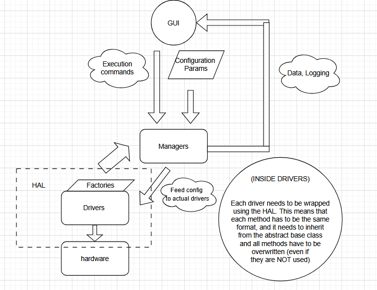

# Hardware Abstraction Layer (HAL) Architecture

## Overview

The 347 Probe system implements a three-layer hardware abstraction layer designed to provide a unified interface for controlling diverse laboratory instruments found in our labs. The goal of the architecture is modularity and extensibility while providing multiprocessing communication between GUI components and hardware controllers.

## Core Architecture Principles

The HAL follows several key design principles that enable seamless integration of new hardware while maintaining clean separation of concerns:

### 1. Abstract Base Classes (ABC) Pattern
Each hardware category defines a abstract base class that establishes the contract for all implementations. The `MotorHAL` class in `motors/hal/motors_hal.py` demonstrates this pattern, defining standardized enums like `AxisType` and `MotorState`, along with async methods for movement, homing, and status monitoring. Similarly, `LdcHAL` and `LaserHAL` provide unified interfaces for temperature control and optical instrumentation respectively. These base classes ensure that any implementation can be substituted without affecting higher-level code.

Some methods are asynchronous. If your method does not require asynchronous communications that is fine; synchronous methods work fine wrapped asynchronously. The main function of this was the offload certain IO bound tasks and to have the background event loop spinning for some MP communications, involving shared memory. In particular, the stage manager has a background loop that queries the position on a timer to update live the stage positioning. There is drag and it is more optimal to over update then to under update the feedback system.

### 2. Factory Pattern with Dynamic Registration
The system employs a factory pattern that allows hardware drivers to self-register at module import time. The `stage_factory.py` implementation shows this approach, it is done by registering certain drivers under a name that is saved in the config and loaded later, and parameter filtering is done during instantiation to ensure that all the params are autofilled. If some driver does not need a constant, it will work the same. When a new driver like `StageControl` calls `register_driver("stage_control", StageControl)`, it becomes immediately available to the configuration system. The factory's parameter filtering uses Python introspection to match configuration parameters to constructor arguments, enabling different drivers to accept different configuration options while sharing a common creation interface.

Pretty much its this: register the driver at the end of your module, import the driver into the manager via the tag (ie. "stage_control"). This then can be saved to the gui by configuration files, which dynamically update once a driver has been registered. 

### 3. Configuration-Driven Hardware Instantiation
Configuration classes like `StageConfiguration` serve as the bridge between JSON configuration files and hardware instantiation. These dataclasses define default values, type constraints, and serialization methods while mapping abstract axis types to specific driver implementations. The configuration system supports per-axis driver selection, allowing mixed hardware configurations where different axes use different motor controllers. 

This means that the default parameters can be saved easily for future use, and we can alter and access specific configurations in a structure manner. Dataclasses in python are very nice and easy to work with. 

## Adding New Hardware Controllers

Integrating a new hardware controller follows a standardized four-step process that ensures consistency and maintainability:

### Step 1: Implement the HAL Interface
Create a new class inheriting from the appropriate HAL base class. For a motor controller, this means implementing `MotorHAL` and providing concrete implementations for all abstract methods including `connect()`, `disconnect()`, `move_absolute()`, `get_position()`, and event handling. The implementation should handle hardware-specific communication protocols while presenting the standardized interface to higher layers.

### Step 2: Register the Driver
Use the factory registration system to make your driver discoverable. Import the appropriate factory module and call the registration function with a unique string identifier and your driver class. This identifier will be used in configuration files to specify which driver should be used for specific hardware instances.

### Step 3: Update Configuration Schema
Modify the configuration dataclass to include any driver-specific parameters. The configuration system's parameter filtering will automatically pass relevant parameters to your driver's constructor while ignoring irrelevant ones. This allows new drivers to introduce specialized configuration options without breaking existing configurations.

### Step 4: Manager Integration
If your hardware requires coordination with other subsystems, integrate it with the appropriate manager class. Managers handle lifecycle operations, shared resources (like serial ports), and coordinate between multiple hardware instances. For example, the `StageManager` coordinates multiple axis controllers that share a single serial connection.

## Multiprocessing and Inter-Process Communication

The architecture implements a hybrid communication strategy optimized for different data types and update frequencies:

### Shared Memory for High-Frequency Data
Position data and other frequently updated information uses structured shared memory implemented with Python's `ctypes` and `multiprocessing.SharedMemory`. The `create_shared_stage_position()` function creates a memory-mapped structure that multiple processes can access directly, eliminating serialization overhead for real-time position updates. This approach is essential for maintaining responsive GUI updates during continuous motion operations. It can also serve as a framework for other high-frequency data processes that are currently not being used at the test stages. 

### JSON-Based Configuration and Commands
Less frequent operations like configuration updates and discrete commands use JSON serialization over shared memory or file-based communication. The `write_shared_stage_config()` function demonstrates this pattern, using length-prefixed JSON to ensure atomic updates. This approach provides human-readable debugging while maintaining type safety through the configuration dataclasses.

### Event-Driven Architecture
Hardware events like move completion, errors, or limit switches trigger event callbacks that propagate through the system. The event system uses standardized event types and structured data payloads, enabling loose coupling between hardware layers and GUI components. Events can be logged, displayed to users, or trigger automated responses like emergency stops. Events should be called from the manager side, so all the controllers have to do is through exceptions and the debug log will automatically display.

## GUI Integration and Configuration Management

The GUI system leverages the HAL architecture through several integration patterns that maintain separation between presentation and hardware control:

### Configuration-Driven UI Generation
GUI components read hardware configurations to dynamically generate appropriate controls. For example, the stage control GUI reads axis configurations to determine available movement ranges, step sizes, and enabled features. This ensures that the GUI automatically adapts to different hardware configurations without requiring code changes. This also means that certain users can have their own configurations for a stage, say if they want their fiber array at a different starting angle for some project.

### Manager-Based Control
GUI components interact with hardware through manager objects rather than directly accessing individual drivers. This pattern provides transaction-like operations where complex sequences can be coordinated atomically. For instance, an area scan operation coordinates stage movement with optical measurements through the respective managers. This means that adding drivers does not destroy functionality, and you **should** be able to drop in controllers.

## Best Practices and Design Patterns

Successful HAL implementations follow several established patterns that ensure reliability and maintainability:

### Resource Management
Use context managers and proper cleanup to ensure hardware resources are released correctly. The async context manager pattern in `StageManager` demonstrates proper startup and shutdown sequencing for complex hardware arrangements.

### Error Handling and Recovery
Implement comprehensive error handling with structured error information. Hardware errors should be captured, logged, and propagated through the event system to enable appropriate user feedback and recovery procedures.

### Parameter Validation
Validate parameters at the HAL boundary rather than relying on hardware to catch invalid inputs. This provides better error messages and prevents potentially harmful operations from reaching the hardware.

### State Synchronization
Maintain software state that reflects hardware reality, with periodic synchronization to handle cases where hardware state changes independently. The position monitoring loop in `StageManager` demonstrates this pattern.

This is an ongoing project and this document will be added among others. I will include some diagrams that put these words into pictures.

This HAL documentation was assisted by Claude Opus and written by Cameron Basara. 